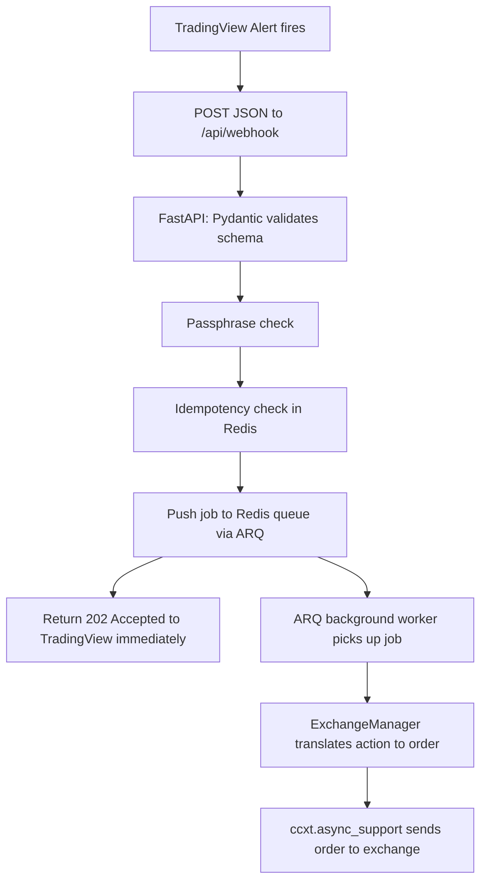

# PineRoute

A Python-based automated trading bridge that connects TradingView PineScript strategy webhooks to cryptocurrency exchanges.

This project is currently **in development**!

## What this project does: Tradingview & PineScript

When you write a strategy in PineScript and it fires off an alert, Tradingview allows you to send an HTTP `POST` request to a URL you specify, with a JSON (or plain text) body you define in the alert's "Message" box, this is the **webhook**.

The problem is that Tradingview's alert:
- has no built-in authentication
- has no duplicate detection (could happen if the server is slow)
- sends raw strings and numbers and not orders ready for exchange APIs
- times out too fast.

So PineRoute has to:
- receive the JSON body and validate its shape/security token
- acknowledge Tradingview immediately (so it doesn't time out) while the trade executes in the background
- deduplicate repeated deliveries of the same alert
- translate the signal into a real exchange order with **ccxt**.

