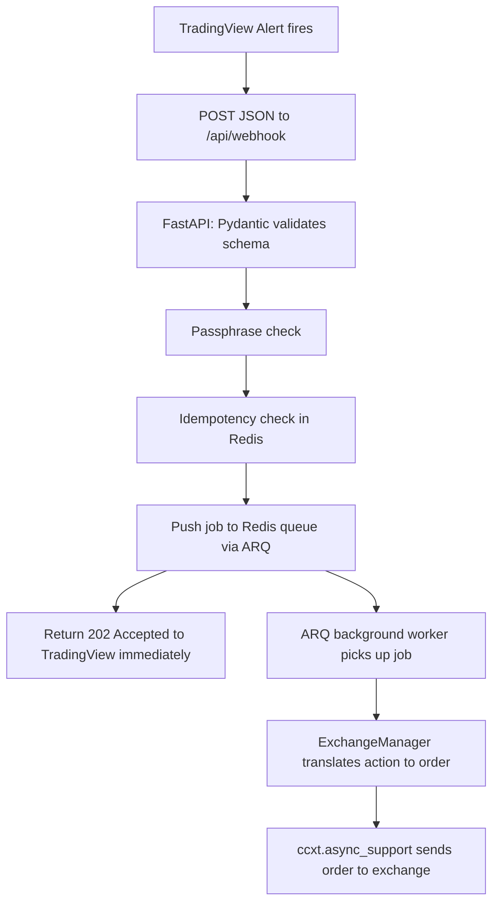

# Part 1: The Problem — What TradingView Actually Sends

TradingView lets you write a strategy in **PineScript** (their charting language) and attach an **alert** to it. When the alert fires, TradingView can send an HTTP `POST` request to a URL you specify, with a JSON (or plain text) body you define in the alert's "Message" box — this is the **webhook**.

The problem: TradingView's webhook is a "fire-and-forget" HTTP POST. It:
- Has **no built-in authentication** (anyone who knows your URL could send fake signals).
- Gives you **no retry guarantee awareness** — if your server is slow, TradingView may retry or the network may duplicate the request, and you won't know unless you build detection yourself.
- Sends raw **strings/numbers**, not exchange-ready orders — e.g. `{"symbol": "BTCUSDT", "action": "buy"}` is meaningless to an exchange API until you know *how much* to buy, on *which* exchange, using *which* order type, with *whose* API keys.
- **Times out fast**. If your endpoint takes too long to place the trade (network lag to Binance, etc.), TradingView may consider the alert failed.

So the "bridge" needs to:
1. **Receive** the JSON and validate its shape/security token instantly.
2. **Acknowledge TradingView immediately** (so it never times out) while the actual trade executes in the background.
3. **Deduplicate** repeated deliveries of the same signal.
4. **Translate** the abstract signal (`buy BTC/USDT`) into a real exchange order via **ccxt** (the library that normalizes ~100 exchanges' different APIs into one consistent interface).

That's exactly what this codebase (`pineroute-core`) does, using this pipeline:



The FastAPI process (web server) and the ARQ worker process (background executor) are **separate processes** that only communicate through Redis. This is the key architectural idea: the web server never talks to the exchange directly, so a slow/rate-limited exchange call can never make TradingView's webhook time out.

---

# Part 2: File-by-File Walkthrough

## `src/main.py` — the FastAPI entry point

```python
import sys
from contextlib import asynccontextmanager
from fastapi import FastAPI
from loguru import logger
from arq import create_pool
from arq.connections import RedisSettings

from core.config import settings
from api.webhooks import router as webhooks_router
```
Standard imports. Note the last two: `core.config` and `api.webhooks` are **unqualified** (not `src.core.config`). This only resolves if Python's import path includes the `src/` directory itself as a root — I'll come back to this in the bugs section, because it's a real footgun.

```python
def setup_logging():
    logger.remove()
    logger.add(sys.stdout,
        format="<green>{time:YYYY-MM-DD HH:mm:ss.SSS}</green> | <level>{level: <8}</level> | "
               "<cyan>{name}</cyan>:<cyan>{function}</cyan>:<cyan>{line}</cyan> - <level>{message}</level>",
        level="INFO",
        colorize=True
    )

setup_logging()
```
`loguru.logger` ships with a default handler already attached. `logger.remove()` deletes it so we can install our own with custom formatting (timestamp, log level padded to 8 chars, colorized, showing module/function/line). `setup_logging()` runs **at import time**, meaning simply importing `main.py` configures logging for the whole app — this is why other files can just `from loguru import logger` and get the same formatted output without re-configuring it.

```python
@asynccontextmanager
async def lifespan(fastapi_app: FastAPI):
    logger.info("PineRoute Bridge is starting up...")
    redis_settings = RedisSettings(host=settings.REDIS_HOST, port=settings.REDIS_PORT)
    fastapi_app.state.redis = await create_pool(redis_settings)
    logger.info("Redis connection pool created")

    yield  # App runs here

    logger.info("PineRoute Bridge is shutting down...")
    if hasattr(fastapi_app.state, "redis"):
        await fastapi_app.state.redis.aclose()
        logger.info("Redis connection pool closed")
```
This is FastAPI's modern "lifespan" pattern (replaces the older `@app.on_event("startup")`). Everything before `yield` runs once when the server boots; everything after runs once when it shuts down. Here it creates an **ARQ Redis connection pool** and stores it on `app.state.redis` — `app.state` is just a generic namespace object FastAPI provides for stashing shared resources so any route handler can reach them via `request.app.state`. On shutdown it closes that pool cleanly (`aclose()` is the async version of `close()`).

```python
app = FastAPI(
    title="PineRoute Bridge",
    description="Automated Trading Bridge for TradingView signals",
    version="0.1.0",
    lifespan=lifespan
)

app.include_router(webhooks_router, prefix="/api")

@app.get("/health")
async def health_check():
    return {"status": "healthy"}
```
Creates the FastAPI app, wires in the `lifespan` context manager, mounts the webhook router **under the `/api` prefix** (so its `/webhook` route actually becomes `/api/webhook` — important, see bugs), and adds a simple `/health` route for uptime checks.

---

## `src/core/config.py` — environment configuration

```python
from pydantic_settings import BaseSettings, SettingsConfigDict
from pydantic import SecretStr

class Settings(BaseSettings):
    WEBHOOK_PASSPHRASE: SecretStr

    EXCHANGE_ID: str = "binance"
    API_KEY: str = ""
    API_SECRET: SecretStr = SecretStr("")

    PAPER_TRADING: bool = True

    REDIS_HOST: str = "localhost"
    REDIS_PORT: int = 6379

    model_config = SettingsConfigDict(
        env_file=".env",
        env_file_encoding="utf-8",
        extra="ignore"
    )

settings = Settings()
```
`pydantic_settings.BaseSettings` automatically reads matching environment variables (or a `.env` file) and type-casts/validates them. `SecretStr` is a special type that masks the value in logs/`repr()` (so `print(settings)` won't leak your passphrase or API secret) — you must call `.get_secret_value()` to get the plain string. `WEBHOOK_PASSPHRASE` has **no default**, so it's *required* — if it's missing from `.env`, this file will crash with a `ValidationError` the moment it's imported (which is intentional: fail fast rather than silently accept unauthenticated webhooks). `settings = Settings()` builds a single global singleton instance so every other module imports the same object instead of re-reading env vars.

---

## `src/core/exceptions.py` — custom error types

```python
class PineRouteException(Exception):
    pass

class ExchangeConnectionError(PineRouteException):
    pass

class OrderExecutionError(PineRouteException):
    pass

class InvalidSignalError(PineRouteException):
    pass
```
Just a small exception hierarchy. `PineRouteException` is the base class; the others are specific subtypes. This lets other code do `except OrderExecutionError` vs `except ExchangeConnectionError` to react differently, and lets a top-level handler catch everything with `except PineRouteException`. Currently `InvalidSignalError` is defined but never raised anywhere — it's a placeholder for future use.

---

## `src/models/schemas.py` — the webhook's JSON contract

```python
from pydantic import BaseModel, field_validator
from typing import Optional

SUPPORTED_ACTIONS = {"buy", "long", "sell", "short", "exit", "cash", "close"}

class WebhookPayload(BaseModel):
    passphrase: str
    strategy: str
    action: str
    symbol: str
    price: Optional[float] = None
    quantity: Optional[float] = None
    side: Optional[str] = None

    @field_validator("action")
    @classmethod
    def validate_action(cls, value: str) -> str:
        normalized = value.lower()
        if normalized not in SUPPORTED_ACTIONS:
            raise ValueError(f"action must be one of {sorted(SUPPORTED_ACTIONS)}")
        return normalized
```
This `BaseModel` is what FastAPI uses to parse and validate the raw JSON body TradingView sends. If TradingView's JSON is missing a required field (`passphrase`, `strategy`, `action`, `symbol`) or has the wrong type, FastAPI auto-rejects the request with an HTTP `422` **before your route code even runs** — this is the "Pydantic transformation" step: turning an untrusted dict into a guaranteed-valid Python object.

`field_validator("action")` is a Pydantic v2 decorator that runs custom validation on that one field after the basic type check. It lowercases the action string and rejects it (raising `ValueError`, which Pydantic converts into a 422 response) if it's not one of the known trading actions. This guarantees that by the time the value reaches the exchange logic, it's already normalized to lowercase and known-valid.

---

## `src/api/dependencies.py` — passphrase verification

```python
import secrets
from fastapi import HTTPException, Request, status
from loguru import logger
from core.config import settings

def verify_passphrase(passphrase: str, request: Request):
    expected_passphrase = settings.WEBHOOK_PASSPHRASE.get_secret_value()
    if not secrets.compare_digest(passphrase, expected_passphrase):
        client_host = request.client.host if request.client else "unknown"
        logger.warning(f"Unauthorized webhook access attempt from {client_host}")
        raise HTTPException(status_code=status.HTTP_401_UNAUTHORIZED, detail="Invalid passphrase")
    return True
```
`secrets.compare_digest` does a **constant-time string comparison** — unlike `==`, which stops comparing as soon as it finds a mismatched character (this timing difference could theoretically let an attacker guess your passphrase one character at a time via response-time measurements). If it doesn't match, it logs the offending IP and raises a `401`. This is currently called as a plain function inside the route (not wired through FastAPI's `Depends()` injection system, despite living in a file called `dependencies.py`) — functionally fine, just a minor naming/pattern inconsistency.

---

## `src/api/webhooks.py` — the actual `/webhook` route

```python
import hashlib
from fastapi import APIRouter, HTTPException, Request, status
from loguru import logger
from models.schemas import WebhookPayload
from api.dependencies import verify_passphrase

router = APIRouter()
DUPLICATE_SIGNAL_WINDOW_SECONDS = 10
```
Sets up a mini FastAPI "sub-app" (`APIRouter`), separate from `main.py`, so routes can be organized in their own file and merged in later via `app.include_router(...)`.

```python
def _build_idempotency_key(payload: WebhookPayload) -> str:
    fingerprint = "|".join(str(field) for field in (
        payload.strategy, payload.action, payload.symbol,
        payload.quantity, payload.price, payload.side,
    ))
    digest = hashlib.sha256(fingerprint.encode()).hexdigest()
    return f"pineroute:signal:{digest}"
```
Builds a fingerprint string out of every "tradeable" field (joined by `|`), hashes it with SHA-256, and prefixes it with a Redis key namespace. Two webhooks with identical strategy/action/symbol/quantity/price/side produce the *same* Redis key.

```python
@router.post("/webhook", status_code=status.HTTP_202_ACCEPTED)
async def receive_webhook(payload: WebhookPayload, request: Request):
    verify_passphrase(payload.passphrase, request)
    logger.info(f"Received valid signal: {payload.strategy} - {payload.action} for {payload.symbol}")
```
FastAPI automatically parses the incoming JSON body into a `WebhookPayload` (running all the Pydantic validation described above) just by having it as a typed parameter. `status.HTTP_202_ACCEPTED` (202, not 200) is a deliberate signal that "your request was accepted for processing, but not yet completed" — appropriate since the actual trade hasn't happened yet.

```python
    redis_pool = getattr(request.app.state, "redis", None)
    if redis_pool is None:
        logger.error("Redis pool is not initialized")
        raise HTTPException(status_code=status.HTTP_503_SERVICE_UNAVAILABLE, detail="Internal queue error")
```
Safely fetches the Redis pool that `main.py`'s `lifespan` created. Uses `getattr(..., None)` instead of `request.app.state.redis` directly because `Starlette`'s `State` object raises `AttributeError` (not returns `None`) for unset attributes — so a plain attribute access would crash instead of hitting this graceful "unavailable" branch.

```python
    idempotency_key = _build_idempotency_key(payload)
    is_new_signal = await redis_pool.set(
        idempotency_key, "1", nx=True, ex=DUPLICATE_SIGNAL_WINDOW_SECONDS
    )
    if not is_new_signal:
        logger.warning(f"Duplicate signal ignored for {payload.symbol} ({payload.action})")
        return {"status": "duplicate_ignored", "message": "Identical signal already queued recently"}
```
This is the deduplication step. Redis's `SET key value NX EX seconds` is atomic: `NX` means "only set if the key does **not** already exist," and `EX` gives it a 10-second expiry. If the key already existed (meaning an identical signal arrived in the last 10 seconds), `redis_pool.set(...)` returns `None`/falsy, and the code short-circuits with a friendly "duplicate ignored" response instead of queuing a second trade.

```python
    try:
        await redis_pool.enqueue_job(
            'execute_trading_signal',
            payload.model_dump(exclude={'passphrase'})
        )
        logger.info(f"Enqueued execute_trading_signal job for {payload.symbol}")
    except Exception as e:
        logger.error(f"Failed to enqueue task: {e}")
        raise HTTPException(status_code=status.HTTP_500_INTERNAL_SERVER_ERROR, detail="Failed to queue task")

    return {"status": "success", "message": "Signal queued for execution"}
```
`enqueue_job` is ARQ's method to push a background job onto the Redis-backed queue. The first argument, `'execute_trading_signal'`, is a **string** matching the name of the worker function defined in `workers/queue.py`. `payload.model_dump(exclude={'passphrase'})` converts the validated Pydantic object back into a plain `dict` (so it can be JSON-serialized for the queue) and strips the passphrase out (no reason for the worker/secret to travel further than necessary). At this point the HTTP handler returns — TradingView gets its response in milliseconds, regardless of how long the actual exchange call will take.

---

## `src/services/exchange.py` — the ccxt wrapper

```python
import ccxt.async_support as ccxt
from loguru import logger
from typing import Optional, Dict, Any
from core.config import settings
from core.exceptions import ExchangeConnectionError, OrderExecutionError

class ExchangeManager:
    def __init__(self):
        self.exchange_id = settings.EXCHANGE_ID
        self.api_key = settings.API_KEY
        self.api_secret = settings.API_SECRET.get_secret_value()
        self.paper_trading = settings.PAPER_TRADING
        self.exchange: Optional[ccxt.Exchange] = None
```
`ccxt.async_support` is ccxt's asyncio-native variant (vs. the default synchronous `ccxt`) — every exchange method (`fetch_ticker`, `create_order`, etc.) becomes an `async def` you `await`, so a slow API call doesn't block the whole worker process. The constructor just stashes the relevant settings; `self.exchange` starts as `None` until `initialize_exchange()` is called.

```python
    async def initialize_exchange(self) -> None:
        if not hasattr(ccxt, self.exchange_id):
            raise ExchangeConnectionError(f"Exchange {self.exchange_id} not supported by CCXT")

        exchange_class = getattr(ccxt, self.exchange_id)
        self.exchange = exchange_class({
            'apiKey': self.api_key,
            'secret': self.api_secret,
            'enableRateLimit': True,
        })
```
ccxt exposes every supported exchange as a class attribute named after its ID (e.g. `ccxt.binance`, `ccxt.kraken`). `hasattr`/`getattr` dynamically look up the class by the string in `settings.EXCHANGE_ID`, so you can switch exchanges just by changing an env var instead of hardcoding `ccxt.binance(...)`. `enableRateLimit: True` tells ccxt to automatically throttle requests to stay under each exchange's API rate limits.

```python
        if self.paper_trading:
            if 'test' in self.exchange.urls:
                self.exchange.set_sandbox_mode(True)
                logger.info(f"Initialized {self.exchange_id} in SANDBOX (Paper Trading) mode")
            else:
                logger.warning(f"Exchange {self.exchange_id} does not support sandbox mode. LIVE TRADING WARNING!")
```
Many exchanges ccxt supports have a `'test'` entry in their `.urls` dict pointing to a sandbox/testnet API base URL. `set_sandbox_mode(True)` swaps ccxt's internal URLs to that testnet endpoint so orders don't touch real money. If the exchange has no sandbox support, it logs a loud warning instead of silently trading live — a good safety design.

```python
    async def close_exchange(self) -> None:
        if self.exchange:
            await self.exchange.close()
            logger.info("Exchange session closed.")
```
ccxt's async exchanges hold an open `aiohttp` session under the hood; `close()` releases those network resources cleanly (important — otherwise you'd get "Unclosed client session" warnings on shutdown).

```python
    async def execute_order(self, symbol: str, action: str, amount: Optional[float] = None, price: Optional[float] = None) -> Dict[str, Any]:
        if not self.exchange:
            raise ExchangeConnectionError("Exchange not initialized. Call initialize_exchange() first.")

        try:
            logger.info(f"Preparing to execute {action.upper()} order for {symbol}")

            if action.lower() in ['buy', 'long']:
                if not amount:
                    raise OrderExecutionError("Amount is required for buy/long orders")
                # order = await self.exchange.create_market_buy_order(symbol, amount)
                logger.info(f"Executed BUY order for {symbol} of amount {amount}")
                return {"status": "success", "action": "buy", "symbol": symbol, "amount": amount}

            elif action.lower() in ['sell', 'short']:
                if not amount:
                    raise OrderExecutionError("Amount is required for sell/short orders")
                # order = await self.exchange.create_market_sell_order(symbol, amount)
                logger.info(f"Executed SELL order for {symbol} of amount {amount}")
                return {"status": "success", "action": "sell", "symbol": symbol, "amount": amount}

            elif action.lower() in ['exit', 'cash', 'close']:
                logger.info(f"Executed EXIT order for {symbol}")
                return {"status": "success", "action": "exit", "symbol": symbol}

            else:
                logger.error(f"Unknown action: {action}")
                raise OrderExecutionError(f"Unknown action: {action}")
```
**This is the important part to notice:** the actual `ccxt` calls (`create_market_buy_order`, `create_market_sell_order`) are **commented out**. Right now this function only logs what it *would* do and returns a fake success dict. Nothing is ever actually sent to the exchange yet — this is explicitly called out in `docs/usage.md` as unfinished ("Order Logic Refinement" needed). Don't be surprised that trades never appear on your exchange account; that's expected at this stage of development.

```python
        except ccxt.RateLimitExceeded as e:
            logger.error(f"Rate limit exceeded on {self.exchange_id}: {e}")
            raise OrderExecutionError(f"RateLimitExceeded: {e}")
        except ccxt.NetworkError as e:
            logger.error(f"Network error communicating with {self.exchange_id}: {e}")
            raise OrderExecutionError(f"NetworkError: {e}")
        except ccxt.ExchangeError as e:
            logger.error(f"Exchange error from {self.exchange_id}: {e}")
            raise OrderExecutionError(f"ExchangeError: {e}")
        except Exception as e:
            logger.exception(f"Unexpected error executing order: {e}")
            raise OrderExecutionError(str(e))
```
ccxt has its own hierarchy of exception types (`NetworkError`, `ExchangeError`, `RateLimitExceeded` is a subtype of `NetworkError`). This code catches each specific type, logs an appropriately-scoped message, and re-raises it as the project's own `OrderExecutionError` — so calling code (the worker) only ever needs to know about `PineRouteException` subtypes, not ccxt internals. `logger.exception(...)` in the final fallback also automatically attaches the full traceback to the log output.

---

## `src/workers/queue.py` — the ARQ background worker

```python
from typing import Dict, Any
from loguru import logger
from arq.connections import RedisSettings
from redis.asyncio import Redis
from core.config import settings
from services.exchange import ExchangeManager

async def startup(ctx: Dict[str, Any]) -> None:
    logger.info("Worker starting up. Initializing Exchange Manager...")
    exchange_manager = ExchangeManager()
    await exchange_manager.initialize_exchange()
    ctx['exchange'] = exchange_manager
    logger.info("Worker startup complete.")

async def shutdown(ctx: Dict[str, Any]) -> None:
    logger.info("Worker shutting down...")
    exchange_manager: ExchangeManager = ctx.get('exchange')
    if exchange_manager:
        await exchange_manager.close_exchange()
    logger.info("Worker shutdown complete.")
```
ARQ workers run as their own process, separate from the FastAPI process. `ctx` (context) is a plain dict ARQ passes to every hook and job function; it's used here to store a single, shared `ExchangeManager` instance for the whole worker's lifetime, created once in `startup` and cleaned up once in `shutdown` (mirroring the FastAPI `lifespan` pattern, but for the worker process).

```python
async def execute_trading_signal(ctx: Dict[str, Any], payload: Dict[str, Any]) -> Dict[str, Any]:
    redis: Redis = ctx['redis']
    exchange_manager: ExchangeManager = ctx['exchange']

    logger.info(f"Processing trading signal from queue: {payload}")

    try:
        symbol = payload.get('symbol')
        action = payload.get('action')
        amount = payload.get('quantity')
        price = payload.get('price')

        result = await exchange_manager.execute_order(
            symbol=symbol, action=action, amount=amount, price=price
        )

        logger.info(f"Successfully processed signal for {symbol}: {result}")
        return result

    except Exception as e:
        logger.error(f"Error processing trading signal for {payload.get('symbol')}: {e}")
        raise
```
This is the actual job that runs when `enqueue_job('execute_trading_signal', ...)` is picked off the queue. `ctx['redis']` is a Redis connection ARQ automatically injects into every job's context (in case you need it — but see the bugs section, it's unused here). `ctx['exchange']` retrieves the `ExchangeManager` set up in `startup`. It pulls the tradeable fields back out of the plain dict (remember, it went through `model_dump()` on the FastAPI side, so it's no longer a Pydantic object here) and calls `execute_order`. On failure it logs then **re-raises**, which lets ARQ apply its own retry/failure-tracking logic instead of silently swallowing the error.

```python
class WorkerSettings:
    functions = [execute_trading_signal]
    redis_settings = RedisSettings(host=settings.REDIS_HOST, port=settings.REDIS_PORT)
    on_startup = startup
    on_shutdown = shutdown
    max_jobs = 10
```
This class is what you point the `arq` CLI at (`arq workers.queue.WorkerSettings`). `functions` is the whitelist of job functions ARQ will accept by name (matching the string `'execute_trading_signal'` used in `enqueue_job`). `on_startup`/`on_shutdown` wire in the two lifecycle hooks above. `max_jobs = 10` caps how many jobs this worker processes concurrently.

---

# Part 3: Bugs & Issues (and how to fix them)

## 1. The server currently has no way to actually start (high priority)

`src/main.py` only *defines* the `app` object — there's no `if __name__ == "__main__":` block that calls `uvicorn.run(...)`. Compounding this, `docs/usage.md` line 8 says:

```
Start the server by typing: `python src/app.#
```

...which references a file that doesn't exist (`app.py` — the real file is `main.py`) and is literally cut off mid-sentence with a stray `#`. Even if you fixed the typo to `python src/main.py`, it still wouldn't start a server — it would just build the FastAPI `app` object and exit immediately, because nothing calls `uvicorn.run()`.

**Fix** — pick one of these:
- Run it via the CLI instead of `python`: from inside `src/`, run
  ```
  uvicorn main:app --reload
  ```
- Or add a runnable entry point at the bottom of `main.py`:
  ```python
  if __name__ == "__main__":
      import uvicorn
      uvicorn.run("main:app", host="0.0.0.0", port=8000, reload=True)
  ```
  then run `python src/main.py`.

## 2. Docs point TradingView at the wrong URL

`docs/usage.md` tells you to send alerts to `/webhook`, but `main.py` mounts the router with `app.include_router(webhooks_router, prefix="/api")`, and the route itself is defined as `@router.post("/webhook", ...)`. The real, combined path is **`/api/webhook`**, not `/webhook`. If you configure a TradingView alert with the documented path, you'll get 404s.

**Fix**: update the doc (and your TradingView alert URL) to `https://your-server/api/webhook`.

## 3. Fragile import paths (`ModuleNotFoundError` risk)

Every internal import in `src/` is unqualified — e.g. `from core.config import settings`, not `from src.core.config import settings`. This only works if the `src/` directory itself is on `sys.path` (i.e., treated as the import root), which happens automatically if:
- Your **current working directory is `src/`** when you launch uvicorn/arq, or
- You pass `--app-dir src` to `uvicorn`.

If you instead (very naturally) run from the project root with `uvicorn src.main:app`, Python will treat `src` as a package, and `from core.config import settings` inside `main.py` will fail with `ModuleNotFoundError: No module named 'core'`, because Python looks for a top-level `core` module, not `src.core`.

**Fix** (pick one, don't mix):
- Simplest: always `cd src` before running `uvicorn main:app --reload` and `arq queue.WorkerSettings` (worker command would then be `arq queue.WorkerSettings`, not `arq workers.queue.WorkerSettings`, when run from inside `src/`).
- More robust: add an empty `src/__init__.py`, prefix every internal import with `src.` (e.g. `from src.core.config import settings`), and always run from the project root (`uvicorn src.main:app --reload`, `arq src.workers.queue.WorkerSettings`). This is more resilient to being run from different working directories.

## 4. Trades are not actually being placed yet

In `src/services/exchange.py`, the real `ccxt` calls are commented out:
```python
# order = await self.exchange.create_market_buy_order(symbol, amount)
```
Right now `execute_order` only logs and returns a synthetic `{"status": "success", ...}` dict — no HTTP request to Binance/Kraken/etc. ever happens. This isn't a "crash" bug, but it's important to know so you don't assume trades are live just because you see "Executed BUY order" in the logs.

**Fix**: uncomment those lines and capture the real return value, e.g.:
```python
order = await self.exchange.create_market_buy_order(symbol, amount)
logger.info(f"Executed BUY order for {symbol} of amount {amount}")
return {"status": "success", "action": "buy", "symbol": symbol, "amount": amount, "order": order}
```
Do this first against `PAPER_TRADING=True` (sandbox) before ever flipping it to live.

## 5. Dead/misleading code in the worker

In `src/workers/queue.py`, `execute_trading_signal` does:
```python
redis: Redis = ctx['redis']
```
...but `redis` is never used anywhere in the function. The comment block above it talks about doing "idempotency check" work, but no such check is implemented here — because it's *already* handled correctly (and atomically) in `src/api/webhooks.py` via the `SET NX EX` Redis pattern before the job is ever queued. As written, this is just unused code/an outdated comment, which could confuse a future reader into thinking dedup isn't handled, or into implementing it twice.

**Fix**: delete the unused `redis` line and the stale comment block, since idempotency is already handled upstream:
```python
async def execute_trading_signal(ctx: Dict[str, Any], payload: Dict[str, Any]) -> Dict[str, Any]:
    exchange_manager: ExchangeManager = ctx['exchange']
    logger.info(f"Processing trading signal from queue: {payload}")
    ...
```

---

### Summary

The design (FastAPI → Pydantic validation → Redis idempotency → ARQ queue → ccxt worker) is solid and follows good practice for decoupling a fast webhook receiver from slow exchange calls. The concrete problems are mostly **incomplete wiring and stale docs** rather than deep logic bugs: there's no way to launch the server as documented, the documented webhook URL is wrong, the import layout is fragile to how/where you run it, and the exchange calls are intentionally stubbed out pending "Phase 3" of the roadmap in `notes.md`.

